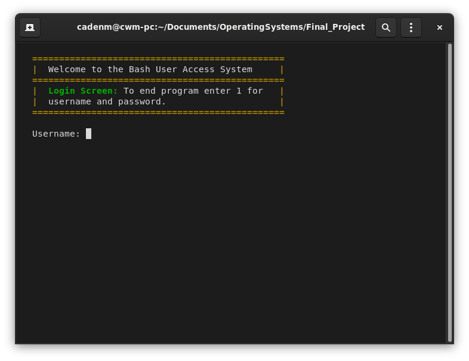

# To run the program
simply run ./login.sh in the terminal

The first time the program is ran, you will automatically be logged in as admin so that the admin can change the default password. After the first login, the admin will have to login the same as everyone else. If there are any concerns, suggestions, or questions about how the code works, feel free to contact me.

# TO-DO List
* ~~Login system~~
* ~~Admin abilities~~
* User abilities
* Access system

The only things that needs functionality added to it is the access.sh file and the user.sh file. The access.sh file gives the user the ability to open directories and files, create files, and delete files based on privilege, and the user.sh file is what controls the user menu. The ability of the user to change the default password needs to be added.

# Colors
I added colors to the program to make it look better. Coloring seems to work natively on linux and on Windows using the windows subsystem for linux, but colors may need to be enabled on Macs to work properly. See below. This is what the program should look like.



# Enable colors on Macs
Edit your .bash_profile (since OS X 10.8) — or (for 10.7 and earlier): .profile or .bashrc or /etc/profile (depending on availability) — in your home directory and add following code:
```
export CLICOLOR=1
```
CLICOLOR=1 simply enables coloring of your terminal.
